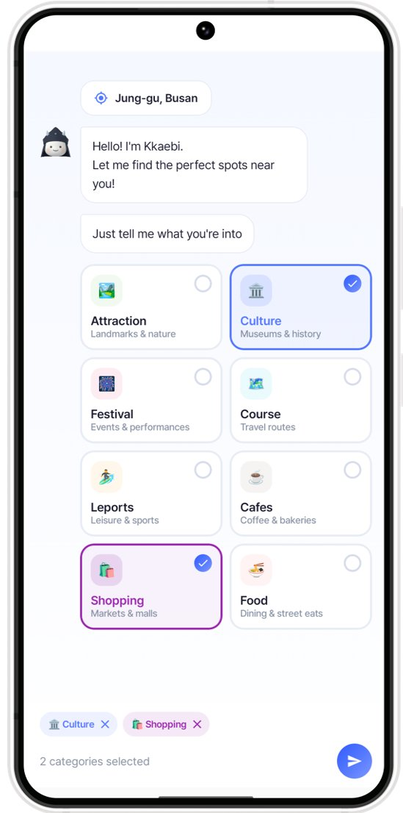
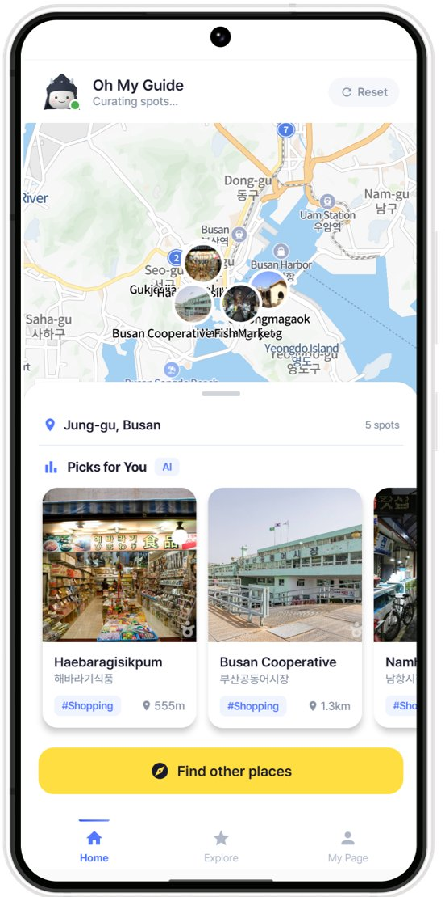
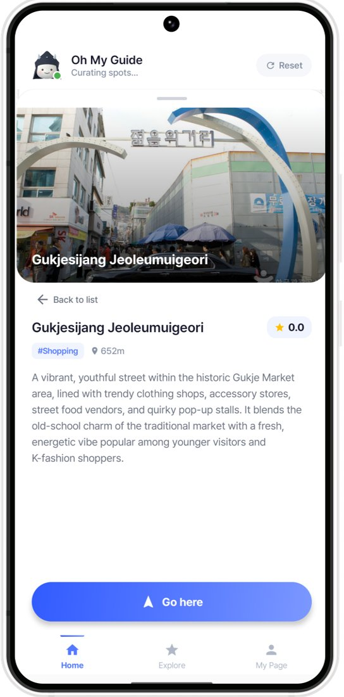
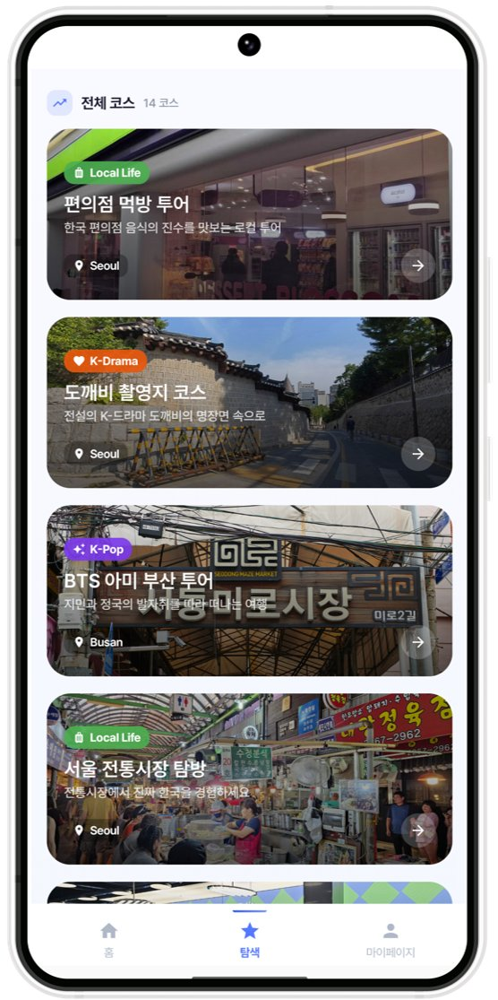
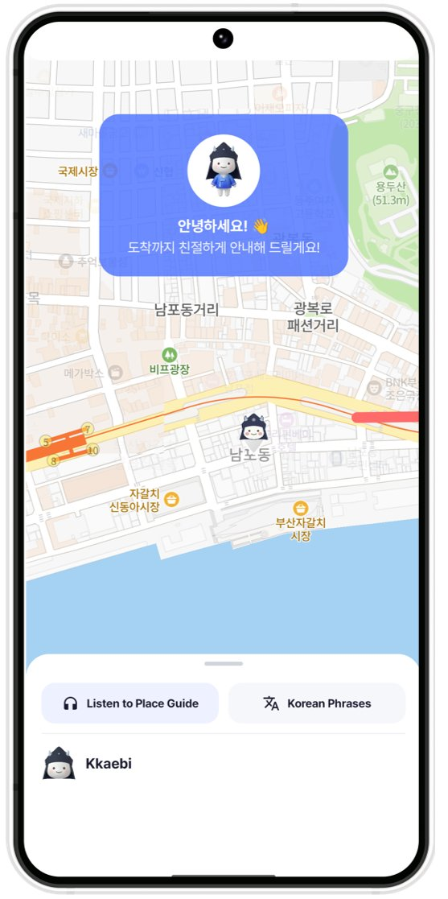
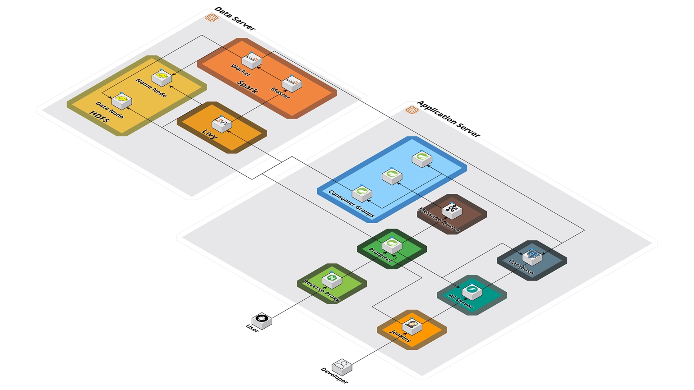
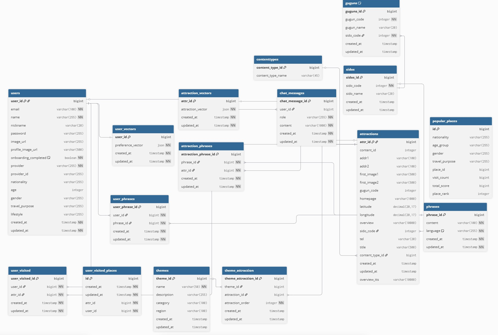

# Oh My Guide

> **외국인 관광객을 위한 AI 기반 맞춤형 한국 여행 추천 및 가이드 서비스**

**삼성청년SW·AI아카데미(SSAFY) 14기 특화 프로젝트**

    

---

## 프로젝트 소개

**Oh My Guide**는 한국을 방문하는 외국인 관광객이 언어와 문화의 장벽 없이 편리하게 여행할 수 있도록 돕는 모바일 서비스입니다.

실시간 위치 기반 맞춤 추천, GPS 길안내, K-Culture 테마 코스, 한국어 표현 가이드까지 — 관광객이 필요로 하는 모든 여행 경험을 하나의 앱에서 제공합니다.

---

## 스크린샷

|로그인|카테고리 선택|실시간 길안내|장소 상세|
|:---:|:---:|:---:|:---:|
|||||

|K-Culture 테마 여행|탐색 (Explore)|코스 상세|코스 목록|
|:---:|:---:|:---:|:---:|
|||||

---

## 주요 기능

### 1. 실시간 위치 기반 개인 맞춤 추천
- 관광객의 **국적, 나이, 동반 유형, 선호 카테고리/분위기**를 반영한 주변 여행지 추천
- 사용자 행동 로그를 실시간으로 집계하여 **비슷한 여행자들의 인기 관광지 Top 5** 추천

### 2. GPS 기반 실시간 길안내 & 장소 가이드
- 별도의 지도 앱 없이 **최적 경로 및 교통수단** 안내
- 도착까지 경로 상의 장소에 대한 **TTS 음성 가이드** 제공

### 3. 외국인 특화 가이드 서비스
- 장소/카테고리에 맞는 **한국어 표현** 즉시 제공 (주문, 길 묻기 등)
- **실시간 날씨 안내** 및 상황 변화 시 대체 장소 즉시 추천

### 4. K-Culture 테마 여행 코스
- K-Drama, K-Pop, 로컬 라이프 등 **테마별 큐레이션 코스** 제공
- 관련 장소들을 하나의 여행 흐름으로 연결한 가이드 서비스

---

## 🛠 기술 스택

| 분류 | 기술 |
|------|------|
| **Frontend** | Kotlin, Android SDK (Jetpack Compose), Native Tailwind CSS |
| **Backend** | Spring Boot, Spring Data JPA, Spring Security, Apache Kafka, Spark |
| **AI** | FastAPI |
| **Database** | PostgreSQL, Redis, HDFS |
| **Infra** | Docker, Jenkins, AWS, Nginx |
| **Monitoring** | K6, Grafana, Prometheus |

---

## 아키텍처 & 기술 특징

### Kafka 기반 실시간 이벤트 수집 & 점수화
- 사용자 행동(상세보기, 선택, 별점)을 **이벤트 단위로 분리**하여 Kafka로 수집
- 각 행동의 중요도에 따라 **가중치(스코어)를 부여**해 집계
- 확장성 높은 이벤트 기반 데이터 파이프라인 구성

### Hadoop + Spark 분산 처리 통계 계산
- 대규모 여행지 DB + 사용자 행동 로그를 Hadoop에 적재
- **새벽 시간대 Spring Scheduler**를 통해 Spark 배치 작업 실행
- 서비스 시간대 부하를 줄이면서 정교한 통계 기반 추천 제공

### 벡터 유사도 기반 개인화 추천
- 사용자 행동 로그 기반 **가중치 사용자 벡터** 생성
- 여행지 속성(카테고리, 지역, 테마) 기반 **장소 벡터** 구성
- 사용자-장소 벡터 간 **유사도 계산**을 통한 개인화 추천

---

## 팀원 및 역할

| 역할 | 이름 |
|------|------|
| **Frontend** | 이승연, 표경보 |
| **Backend** | 송성현, 전준완, 정승현 |
| **AI** | 이정현 |
| **Infra** | 전준완 |

## 시스템 아키텍처
{width=900 height=546}

## ERD
{width=681 height=459}
