# 포팅 매뉴얼 — Oh! My Guide

> 최종 업데이트: 2026-03-29

---

## 목차

1. [프로젝트 개요](#1-프로젝트-개요)
2. [사전 준비](#2-사전-준비)
3. [Step 1 — 인프라 컨테이너 실행](#3-step-1--인프라-컨테이너-실행)
4. [Step 2 — DB 초기 데이터 로드](#4-step-2--db-초기-데이터-로드)
5. [Step 3 — 앱 컨테이너 실행](#5-step-3--앱-컨테이너-실행)
6. [컨테이너 상태 확인](#6-컨테이너-상태-확인)
7. [서비스 접속 URL](#7-서비스-접속-url)
8. [안드로이드 앱 실행](#8-안드로이드-앱-실행)
9. [앱 화면 구성](#9-앱-화면-구성)
10. [종료 및 초기화](#10-종료-및-초기화)

---

## 1. 프로젝트 개요

사용자 위치 기반 실시간 관광지 AI 추천 & 가이드 서비스.

### 아키텍처

```
┌──────────────────────────────────────────────────────────────┐
│                    local-network (Docker)                     │
│                                                              │
│  Spring Boot (8080) ──── PostgreSQL (5432)                   │
│       │                  Redis (6379)                        │
│       │                  Kafka (9092)                        │
│       │                                                      │
│  FastAPI (8000) ──────── HDFS NameNode (9000/9870)           │
│                           HDFS DataNode                      │
│                           Spark Master (7077/18080)          │
│                           Spark Worker (8081)                │
│                           Livy (8998)                        │
│                                                              │
│  Prometheus (9090) ─── Grafana (3000)                        │
│  Loki (3100)                                                 │
└──────────────────────────────────────────────────────────────┘
```

---

## 2. 사전 준비

### 2.1 필수 소프트웨어

- Docker Desktop (또는 Docker Engine + Docker Compose plugin)
- Git

### 2.2 레포지토리 클론

```bash
git clone https://lab.ssafy.com/s14-bigdata-dist-sub1/S14P21E103
cd S14P21E103
```

### 2.3 환경변수 파일 생성

```bash
cp exec/.env.example exec/.env
```

`exec/.env` 파일을 열어 아래 항목을 실제 값으로 채웁니다.

| 변수 | 설명 | 발급 경로 |
|------|------|---------|
| `POSTGRES_PASSWORD` | DB 비밀번호 | 자유 설정 |
| `GRAFANA_ADMIN_PASSWORD` | Grafana 관리자 비밀번호 | 자유 설정 |
| `GOOGLE_CLIENT_ID` | Google OAuth2 Client ID | 아래 **Google OAuth2 설정** 참고 |
| `GOOGLE_CLIENT_SECRET` | Google OAuth2 Client Secret | 아래 **Google OAuth2 설정** 참고 |
| `TOKEN_SECRET` | JWT 서명 키 (256비트 이상 랜덤 문자열) | `openssl rand -hex 32` 로 생성 |
| `TOUR_API_KEY` | 한국관광공사 API 서비스 키 | 아래 **한국관광공사 API 설정** 참고 |
| `GMS_KEY` | SSAFY GMS API 키 | SSAFY 포털에서 발급 |

#### Google OAuth2 설정

1. [Google Cloud Console](https://console.cloud.google.com) 접속
2. 프로젝트 생성 (또는 기존 프로젝트 선택)
3. **API 및 서비스 → 사용자 인증 정보 → 사용자 인증 정보 만들기 → OAuth 클라이언트 ID** 선택
4. 애플리케이션 유형: **웹 애플리케이션**
5. 승인된 리디렉션 URI에 아래 추가:
   ```
   http://localhost:8080/oauth2/callback/google
   ```
6. 생성 후 발급된 **클라이언트 ID**와 **클라이언트 보안 비밀**을 `exec/.env`에 입력:
   ```env
   GOOGLE_CLIENT_ID=발급받은_클라이언트_ID
   GOOGLE_CLIENT_SECRET=발급받은_클라이언트_보안_비밀
   ```

#### 한국관광공사 API 설정

1. [공공데이터포털](https://www.data.go.kr) 접속 후 회원가입/로그인
2. **"한국관광공사 국문 관광정보 서비스(KorService2)"** 검색 후 활용 신청
3. 승인 후 **마이페이지 → 개발계정 → 일반 인증키(Encoding)** 복사
4. `exec/.env`에 입력:
   ```env
   TOUR_API_KEY=발급받은_서비스_키
   ```

### 2.4 Docker 네트워크 생성

```bash
# 최초 1회만 실행
docker network create local-network
```

---

## 3. Step 1 — 인프라 컨테이너 실행

> Spring Boot가 먼저 기동되면 DB 테이블을 자동 생성해 dump 로드 시 충돌이 발생합니다.
> 인프라만 먼저 실행한 뒤 dump를 로드하고, 이후 앱을 실행해야 합니다.

> 모든 명령어는 프로젝트 루트(`S14P21E103/`)에서 실행합니다.

```bash
docker compose -f exec/docker-compose.local.yml --env-file exec/.env up -d --build \
  postgresql redis kafka \
  namenode datanode spark-master spark-worker livy \
  prometheus grafana loki postgres-exporter node-exporter kafka-exporter
```

> **최초 실행 시** Livy 이미지 빌드로 약 2~3분 소요됩니다.

postgresql 컨테이너가 `healthy` 상태가 될 때까지 대기합니다.

```bash
docker inspect postgresql --format='{{.State.Health.Status}}'
# healthy 출력 시 다음 단계로 진행
```

---

## 4. Step 2 — DB 초기 데이터 로드

```bash
docker exec -i postgresql psql -U admin -d ohmyguide < exec/dump_postgresql.sql
```

오류 없이 종료되면 정상입니다.

---

## 5. Step 3 — 앱 컨테이너 실행

```bash
docker compose -f exec/docker-compose.local.yml --env-file exec/.env up -d --build \
  fastapi spring-boot \
  user-visited-consumer attractions-route-consumer hdfs-log-consumer
```

> `spring-boot` 는 기동까지 최대 60초 소요될 수 있습니다.

---

## 6. 컨테이너 상태 확인

```bash
docker compose -f exec/docker-compose.local.yml ps
```

모든 컨테이너가 정상 기동된 상태 예시:

```
NAME                        STATUS
postgresql                  Up (healthy)
redis                       Up (healthy)
kafka                       Up (healthy)
namenode                    Up (healthy)
datanode                    Up (healthy)
spark-master                Up (healthy)
spark-worker                Up (healthy)
livy                        Up
prometheus                  Up
grafana                     Up
loki                        Up
postgres-exporter           Up
node-exporter               Up
kafka-exporter              Up
fastapi                     Up (healthy)
spring-boot                 Up (healthy)
user-visited-consumer       Up
attractions-route-consumer  Up
hdfs-log-consumer           Up
```

---

## 7. 서비스 접속 URL

| 서비스 | URL | 설명 |
|-------|-----|------|
| Spring Boot API | `http://localhost:8080/actuator/health` | `{"status":"UP"}` 이면 정상 |
| FastAPI | `http://localhost:8000/health` | `{"status":"ok"}` 이면 정상 |
| Grafana | `http://localhost:3000` | admin / `GRAFANA_ADMIN_PASSWORD` 로 로그인 |
| Prometheus | `http://localhost:9090` | 메트릭 수집 현황 |
| HDFS Web UI | `http://localhost:9870` | HDFS 파일 시스템 상태 |
| Spark Master UI | `http://localhost:18080` | Spark 클러스터 상태 |
| Livy API | `http://localhost:8998/batches` | Spark Job 목록 |

---

## 8. 안드로이드 앱 실행

### 8.1 개발 환경

- Android Studio (최신 버전 권장)
- Android SDK: compileSdk 36, minSdk 24
- JDK 11 이상

### 8.2 local.properties 생성

`mobile/local.properties` 파일을 생성하고 아래 항목을 채웁니다.

> `local.properties`는 `.gitignore`에 등록되어 있습니다. 절대 커밋하지 마세요.

```properties
# Android SDK 경로 (Android Studio가 자동 생성, 없으면 직접 입력)
sdk.dir=/Users/<사용자명>/Library/Android/sdk          # macOS
# sdk.dir=C\:\\Users\\<사용자명>\\AppData\\Local\\Android\\Sdk  # Windows

# ── 백엔드 API 주소 ─────────────────────────────────────────────
# 에뮬레이터에서 실행: 10.0.2.2 는 호스트 머신(localhost)을 가리킴
BASE_URL=http://10.0.2.2:8080/
# 실제 기기에서 실행: PC의 로컬 IP 주소 입력 (ifconfig / ipconfig 로 확인)
# BASE_URL=http://192.168.x.x:8080/

# ── Google OAuth2 ───────────────────────────────────────────────
# 백엔드 설정 시 발급한 Google Cloud 프로젝트의 웹 클라이언트 ID
GOOGLE_WEB_CLIENT_ID=<Google OAuth2 웹 클라이언트 ID>

# ── Google Cloud TTS ────────────────────────────────────────────
# Google Cloud Console → Text-to-Speech API 활성화 후 API 키 발급
GOOGLE_CLOUD_TTS_KEY=<Google Cloud TTS API 키>

# ── Naver Maps ──────────────────────────────────────────────────
# https://console.ncloud.com → Services → Maps → Application 등록
# 플랫폼: Android, 앱 패키지명: com.ohmyguide.app
NAVER_MAP_CLIENT_ID=<Naver Maps Client ID>
NAVER_MAP_CLIENT_SECRET=<Naver Maps Client Secret>

# ── ODSAY (대중교통 경로) ────────────────────────────────────────
# https://lab.odsay.com 회원가입 후 API 키 발급
ODSAY_API_KEY=<ODSAY API 키>

# ── T-Map (도보 경로) ────────────────────────────────────────────
# https://openapi.sk.com 회원가입 → 앱 등록 후 API 키 발급
TMAP_APP_KEY=<T-Map App Key>

# ── 부산 버스 도착 정보 (BIMS) ───────────────────────────────────
# https://www.data.go.kr → "부산광역시_버스도착정보" 검색 후 활용 신청
BUSAN_BIMS_SERVICE_KEY=<부산 BIMS 서비스 키>
```

#### API 키 발급 경로 요약

| 키 | 발급 경로 |
|----|---------|
| `GOOGLE_WEB_CLIENT_ID` | 백엔드 Google OAuth2 설정 시 생성된 것과 동일한 프로젝트의 **웹 클라이언트 ID** 사용 |
| `GOOGLE_CLOUD_TTS_KEY` | [Google Cloud Console](https://console.cloud.google.com) → Text-to-Speech API 활성화 → API 키 생성 |
| `NAVER_MAP_CLIENT_ID` / `SECRET` | [Naver Cloud Platform](https://console.ncloud.com) → Services → AI·NAVER API → Maps → Application 등록 |
| `ODSAY_API_KEY` | [ODSAY Lab](https://lab.odsay.com) → 회원가입 → 서비스키 발급 |
| `TMAP_APP_KEY` | [SK Open API](https://openapi.sk.com) → 회원가입 → 앱 등록 → T Map Mobility API 신청 |
| `BUSAN_BIMS_SERVICE_KEY` | [공공데이터포털](https://www.data.go.kr) → "부산광역시_버스도착정보서비스" 신청 |

### 8.3 빌드 및 실행

1. Android Studio에서 `mobile/` 디렉터리를 프로젝트로 열기
2. Gradle Sync 완료 대기
3. 에뮬레이터 또는 실제 기기 연결
4. **Run** (▶) 버튼 클릭

### 8.4 에뮬레이터 vs 실제 기기

| 구분 | BASE_URL |
|------|---------|
| 에뮬레이터 | `http://10.0.2.2:8080/` |
| 실제 기기 (PC와 동일 Wi-Fi) | `http://<PC의 로컬 IP>:8080/` |

PC의 로컬 IP 확인 방법:
```bash
# macOS / Linux
ifconfig | grep "inet " | grep -v 127.0.0.1

# Windows
ipconfig
```

---

## 9. 앱 화면 구성

### 시작 화면

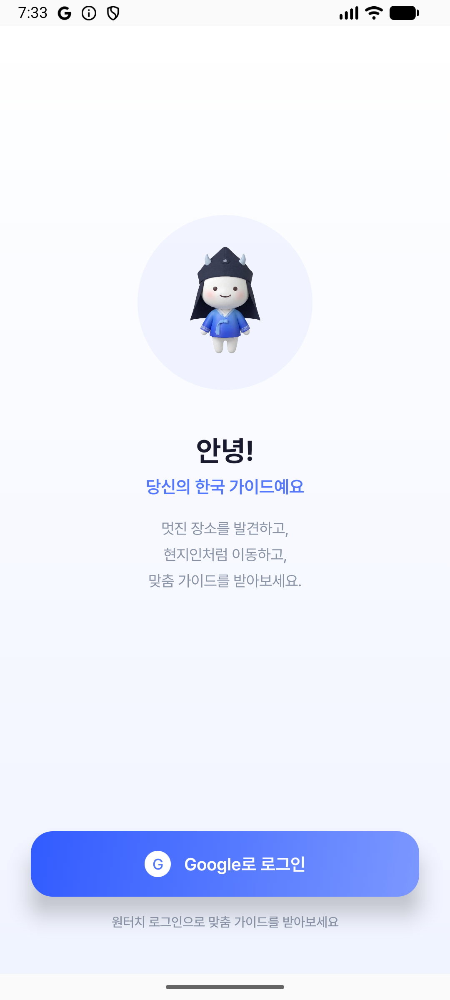

---

### 로그인 페이지


---

### 사용자 기초 정보 수집

로그인 후 처음 사용하는 사용자에게 아래 순서로 기초 정보를 수집합니다.

<table>
  <tr>
    <td align="center"><b>언어 선택</b></td>
    <td align="center"><b>성별 선택</b></td>
    <td align="center"><b>나이 선택</b></td>
    <td align="center"><b>나라 선택</b></td>
    <td align="center"><b>여행 타입 선택</b></td>
  </tr>
  <tr>
    <td>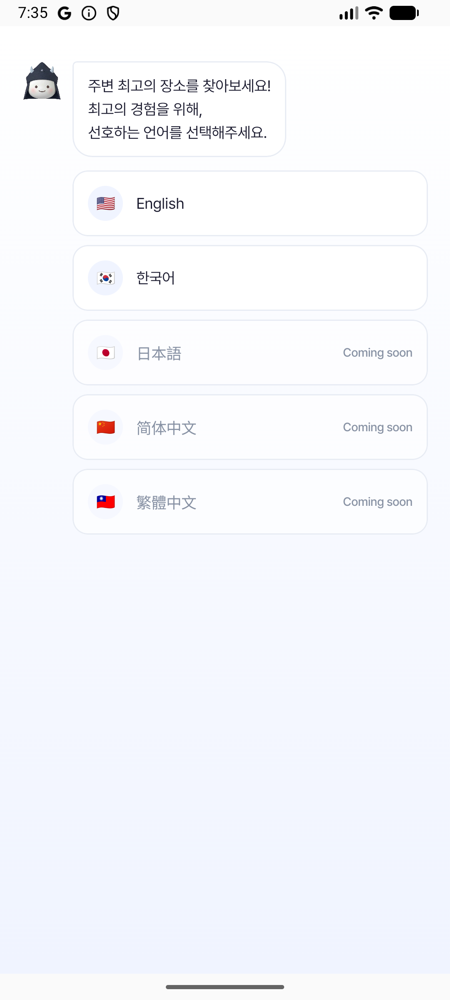</td>
    <td>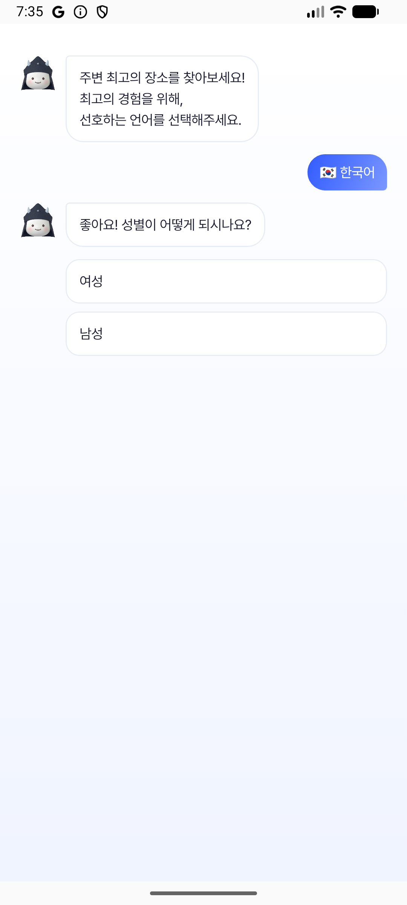</td>
    <td>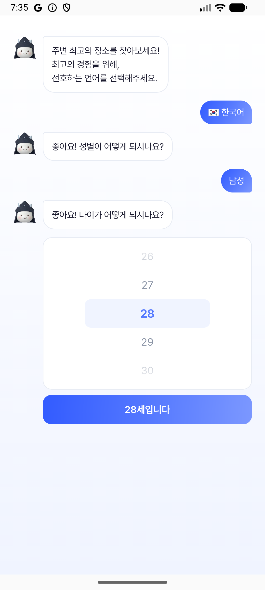</td>
    <td>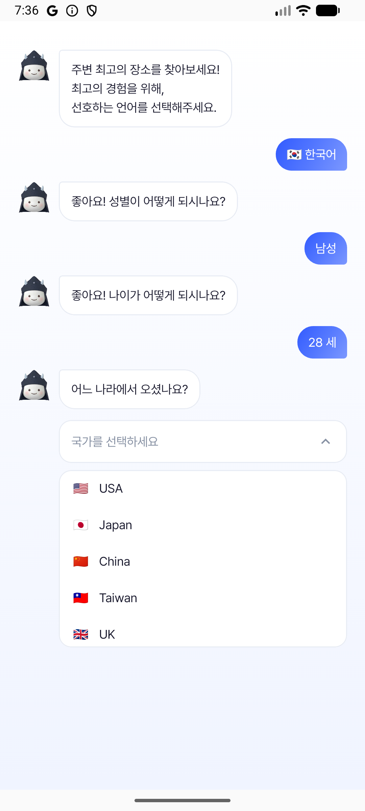</td>
    <td>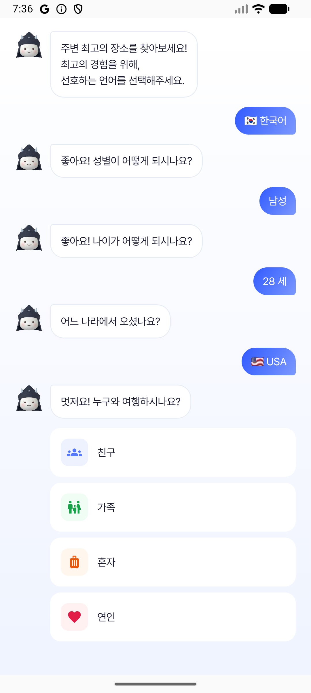</td>
  </tr>
</table>

---

### 카테고리 선택 페이지

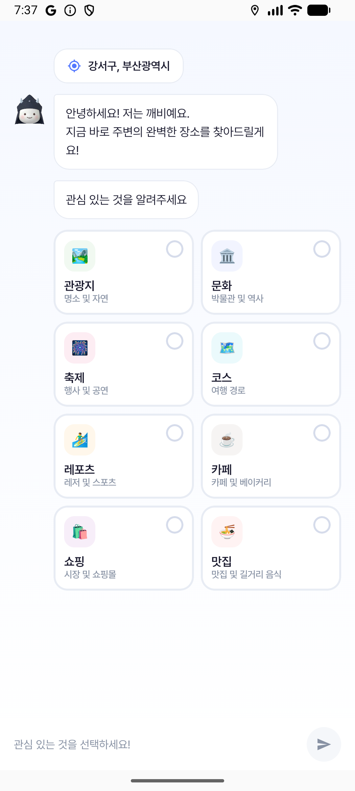

---

### 추천 결과 페이지

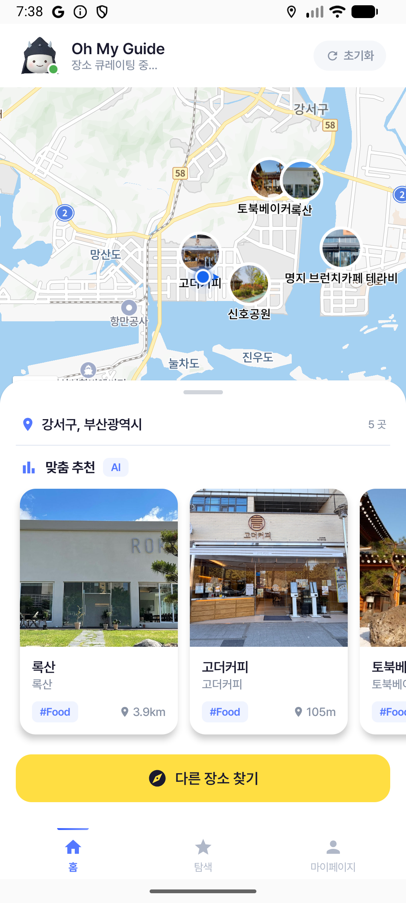

---

### 코스 탐색 / 코스 디테일 / 코스 실행

<table>
  <tr>
    <td align="center"><b>코스 탐색</b></td>
    <td align="center"><b>코스 디테일</b></td>
    <td align="center"><b>실제 코스</b></td>
  </tr>
  <tr>
    <td></td>
    <td>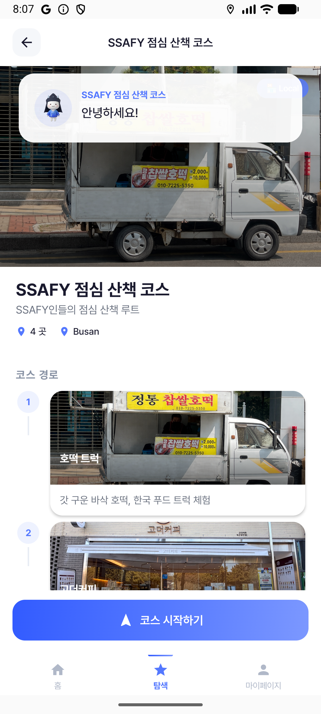</td>
    <td>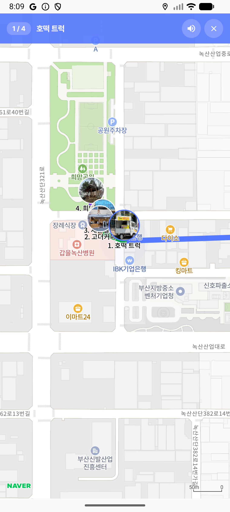</td>
  </tr>
</table>

---

### 재추천 및 새 추천

장소 방문 후 재추천 유형을 선택하면 새로운 장소를 추천받을 수 있습니다.

<table>
  <tr>
    <td align="center"><b>재추천 유형 1</b></td>
    <td align="center"><b>재추천 유형 2</b></td>
    <td align="center"><b>새 추천 결과</b></td>
  </tr>
  <tr>
    <td>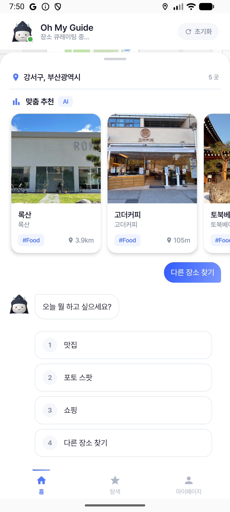</td>
    <td>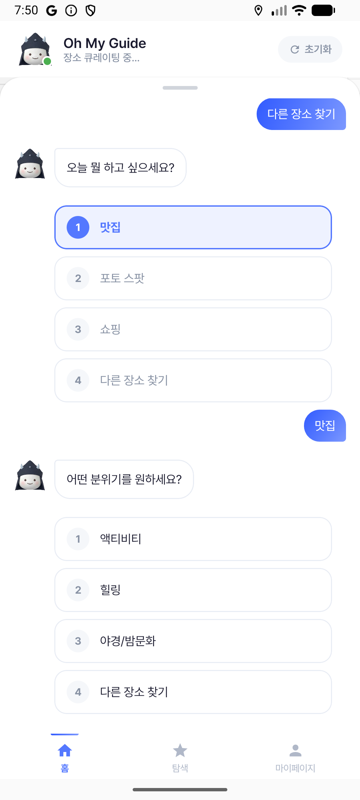</td>
    <td>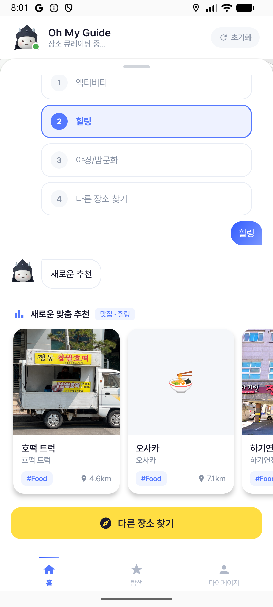</td>
  </tr>
</table>

---

### 장소 상세 / 교통 수단 선택 / 경로 확인 / 가이드 / 문구

<table>
  <tr>
    <td align="center"><b>장소 상세</b></td>
    <td align="center"><b>교통 수단 선택</b></td>
    <td align="center"><b>경로 확인</b></td>
    <td align="center"><b>가이드</b></td>
    <td align="center"><b>문구</b></td>
  </tr>
  <tr>
    <td>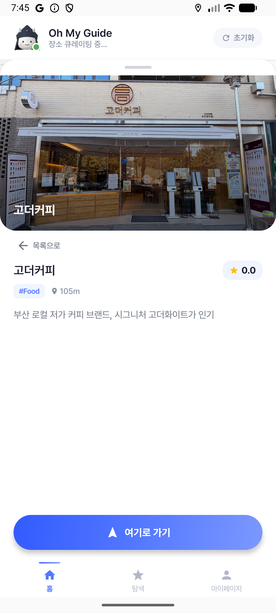</td>
    <td>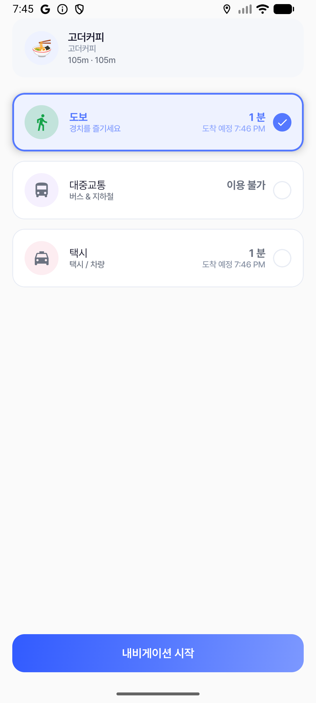</td>
    <td>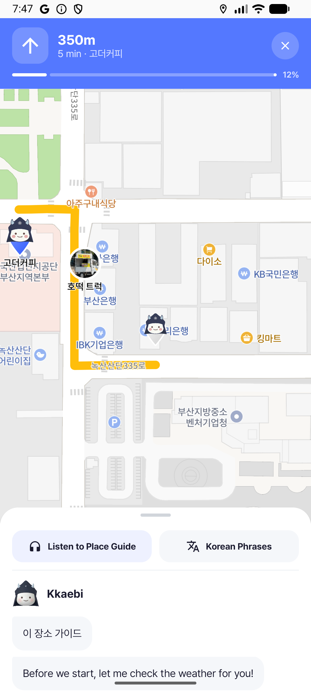</td>
    <td>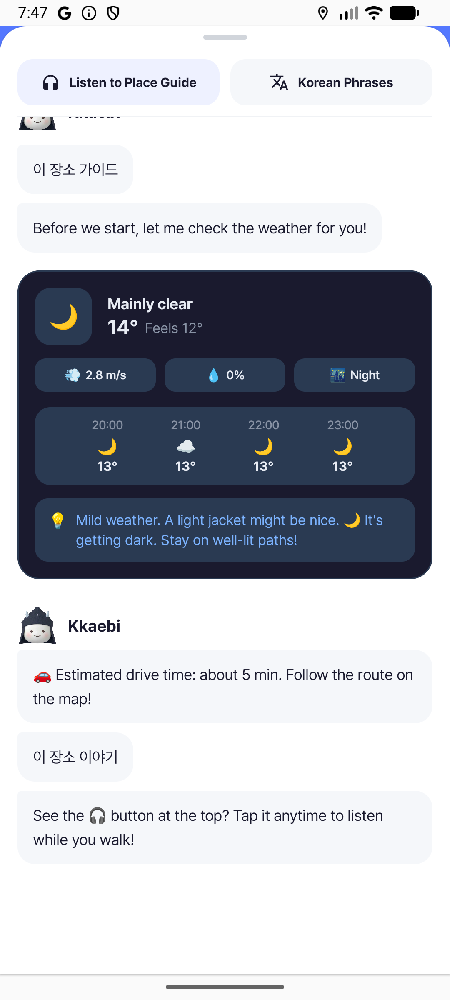</td>
    <td>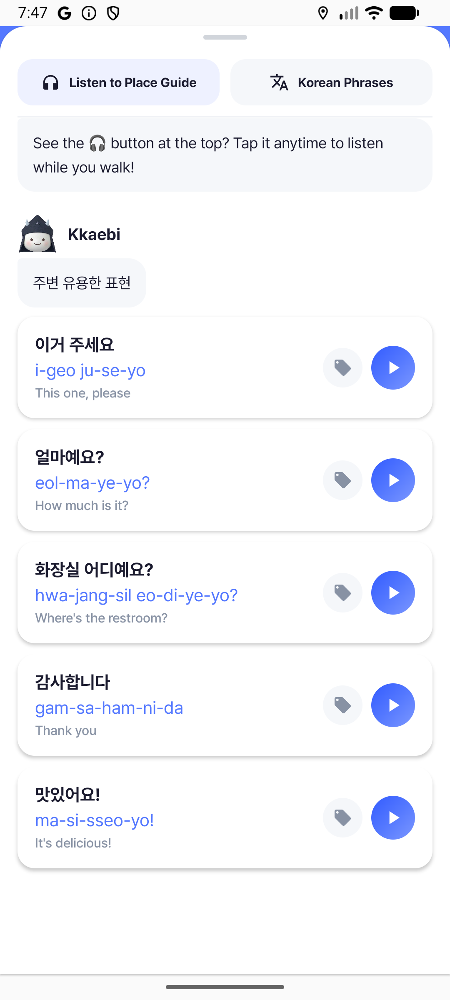</td>
  </tr>
</table>

---

### 마이페이지

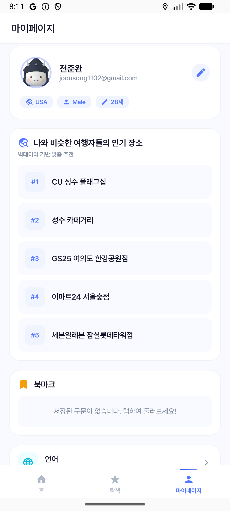

---

## 10. 종료 및 초기화

### 컨테이너만 종료 (데이터 유지)

```bash
docker compose -f exec/docker-compose.local.yml down
```

### 컨테이너 + 볼륨 전체 삭제 (데이터 초기화)

```bash
docker compose -f exec/docker-compose.local.yml down -v
```

> 볼륨 삭제 후 재실행하면 [Step 1](#3-step-1--인프라-컨테이너-실행)부터 다시 수행해야 합니다.
